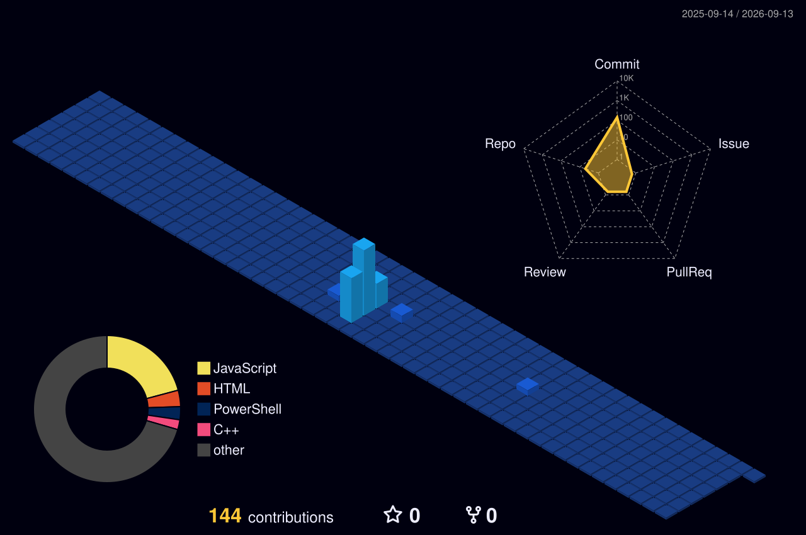

  
  
   
   

  <table width="100%" style="border-collapse: collapse; border: none;">
    <tr>
      <td align="center" style="border: none;">
        
      </td>
    </tr>
  </table>

   

  

    <code>Software Development & Engineering</code> • 
    <code>Computer Networking & Infrastructure</code> • 
    <code>IT Support & Systems Administration</code>
  

   

  
  

## About Me

I am a **Bachelor of Information Technology** student at **Universiti Teknologi PETRONAS (UTP)**. I specialize in bridging the gap between complex technical systems and strategic corporate objectives.

With a strong foundation in **Software Engineering** and **Cybersecurity**, I focus on building secure, data-driven solutions that solve real-world problems.

- **Technical Versatility:** Experienced in full-stack web development, IoT systems, and automated network diagnostics.
- **Data-Driven Insight:** Proficient in data science and analytics to turn raw system logs into actionable business intelligence.
- **Leadership & Coordination:** Beyond the code, I lead teams and engage stakeholders to ensure technical projects meet corporate timelines and quality standards.

> **Current Mission:** Seeking industry opportunities to apply my expertise in Information Assurance and System Integration while contributing to high-impact technology projects.

## Tech Stack & Tools

### Programming Languages

  

### Web & Mobile Development

  

### Data & Databases

  

### Hardware & Tools

  

## GitHub Statistics

  
  

## Contribution Graph

## Activity Pulse

  

## Pac-Man

  <picture>
    <source media="(prefers-color-scheme: dark)" srcset="https://raw.githubusercontent.com/muhammadsolihinmadsarib/muhammadsolihinmadsarib/output/pacman-contribution-graph-dark.svg">
    <source media="(prefers-color-scheme: light)" srcset="https://raw.githubusercontent.com/muhammadsolihinmadsarib/muhammadsolihinmadsarib/output/pacman-contribution-graph.svg">
    
  </picture>

## Space Shooter

  

##

<pre>
 ______     ______     __         __     __  __     __     __   __    
/\  ___\   /\  __ \   /\ \       /\ \   /\ \_\ \   /\ \   /\ "-.\ \   
\ \___  \  \ \ \/\ \  \ \ \____  \ \ \  \ \  __ \  \ \ \  \ \ \-.  \  
 \/\_____\  \ \_____\  \ \_____\  \ \_\  \ \_\ \_\  \ \_\  \ \_\\"\_\ 
  \/_____/   \/_____/   \/_____/   \/_/   \/_/\/_/   \/_/   \/_/ \/_/ 
                                                                      
</pre>

  <code><b>SYSTEM STATUS:</b> ONLINE</code> • <code><b>NETWORK:</b> SECURE</code>
   
   
  <i>"Bridging the gap between complex systems and corporate strategy."</i>

  

